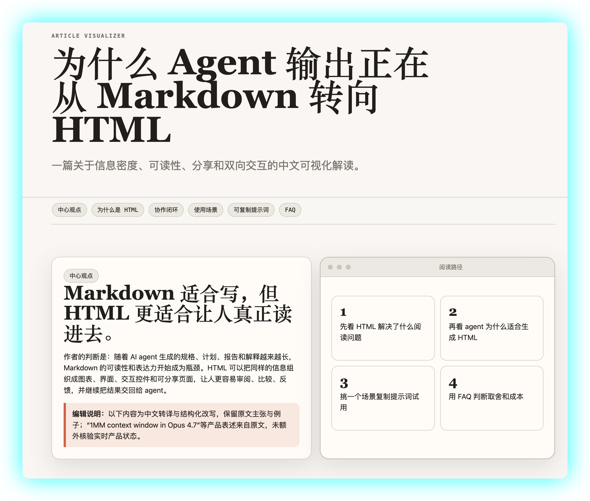

<div align="center">

# html-article-visualizer

**让 AI 输出值得被读完。**

把文章、长文本、研究材料、PR/代码说明、产品方案、报告或结构化资料，转化为完整、自包含、可直接打开的单文件 HTML5 可视化文档。

[English](./README.en.md) · 简体中文



</div>

---

## 缘起

这个 skill 受 Anthropic Claude Code 团队成员 Thariq（[@trq212](https://x.com/trq212/status/2052809885763747935?s=20)）的帖子《HTML 的不合理有效性》启发。

核心观点是：**在 AI Agent 时代，Markdown 已不再是最佳的人机沟通格式，HTML 才是。**

理由很直接——

> 当 AI 输出的内容超过 100 行，人几乎不会认真读完。

而 HTML 能把同样的信息组织成图表、标签页、交互控件和可分享页面，让人真正愿意读进去，并能把反馈重新带回给 AI，形成闭环。

这个 skill 就是对这一理念的工程化实践。

## 它解决什么问题

- **长输出无人读**：Agent 一次输出 5000 字，读者只看前两段。HTML 能用层级、目录、折叠、标签页把信息密度做高。
- **Markdown 表达不够**：流程、对比、关系、时间线在 Markdown 里只能堆文字；HTML + SVG 能直接画出来。
- **反馈难闭环**：Markdown 输出不能交互。HTML 可以加复制按钮、勾选清单、参数滑块，让人改完再丢回 Agent。
- **分享成本高**：Notion / 飞书有平台依赖，单文件 HTML 任何浏览器直接打开，也能 PDF 导出、邮件发送、放进知识库。

## 适用场景

| 类型 | 输出形态 |
| --- | --- |
| 文章 / 论文解读 | 主张-论证-反例-行动建议的结构化版面 |
| 产品方案 / 规格 | 目标、约束、决策矩阵、流程图、待确认问题 |
| PR / 代码说明 | diff、调用链、风险标注、审查结论 |
| 研究报告 | 摘要、证据表、时间线、数据图、结论 |
| 提示词 / 工具包 | 可复制代码块、参数编辑器、实时预览 |

## 快速开始

### 1. Claude Code

把整个目录复制到 Claude Code 的 skills 路径：

```bash
git clone https://github.com/SilenceBoy/html-article-visualizer.git \
  ~/.claude/skills/html-article-visualizer
```

启动 Claude Code 后，直接说：

> 把这篇文章生成 HTML 可视化：<贴上原文或文件路径>

### 2. Codex / OpenClaw 等 OpenAI 风格 Agent

仓库提供了 [`agents/openai.yaml`](./agents/openai.yaml)，可作为 agent 元数据导入。最低形态是把 `SKILL.md` 作为 system prompt 注入，并把 `references/`、`assets/`、`scripts/` 暴露为可读资源。

### 3. 任意 LLM / 手工调用

不接入 agent 框架也可以用——把 [`SKILL.md`](./SKILL.md) 和 [`references/article-to-html-prompt.md`](./references/article-to-html-prompt.md) 拼成 system prompt 喂给模型，再把要可视化的内容放进 user message。

## 目录结构

```
.
├── SKILL.md                          # 主入口：工作流、设计要求、输出约束
├── agents/
│   └── openai.yaml                   # OpenAI 风格 agent 注册元数据
├── assets/
│   ├── styles/
│   │   └── warm-neutral-artifact.css # 默认视觉风格（warm neutral）
│   ├── templates/
│   │   └── artifact-template.html    # 单文件 HTML 外壳模板
│   └── examples/                     # 案例 SVG，可内联到产物
├── references/
│   ├── article-to-html-prompt.md     # 可裁剪的提示词模板
│   ├── default-style-system.md       # 默认风格说明
│   └── token-efficiency.md           # 节省 token 的合成策略
├── scripts/
│   └── build_artifact.py             # 把正文 fragment 合成为单文件 HTML
└── images/
    └── exp.png                       # README 顶部展示图
```

## 自定义

- **换风格**：让模型读取你的品牌色、字体、参考图，或直接替换 `assets/styles/warm-neutral-artifact.css`。
- **换案例图**：在 `assets/examples/` 里增删 SVG，并在 `SKILL.md` 中更新引用清单。
- **换提示词**：基于 `references/article-to-html-prompt.md` 复制一份，写你自己的场景模板。
- **节省 token**：使用 `scripts/build_artifact.py` 合成产物，模型只产出正文 fragment，避免每次重复生成固定 CSS 与外壳。

## 设计原则

- **阅读效率第一**：视觉服务于理解，不做无意义装饰。
- **结构化编辑**：不是把原文包一层网页，而是先重组信息架构再选表现形式。
- **单文件可分享**：默认产出能直接用浏览器打开的 `.html`，不依赖外部资源。
- **可访问性兜底**：语义标签、对比度、键盘可达、无 JS 时核心内容仍可读。

## 致谢

- [Thariq (@trq212)](https://x.com/trq212/status/2052809885763747935?s=20) — 《HTML 的不合理有效性》的核心论点来自这条帖子。
- Anthropic Claude Code 团队 — 提供了 skill 这一机制本身。

## License

[MIT](./LICENSE) © Robin Liang
